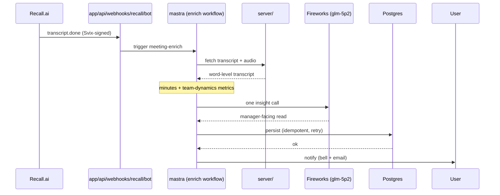
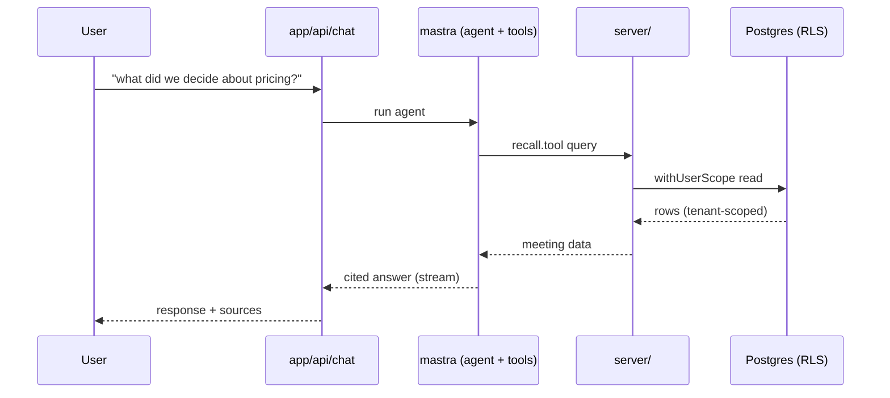
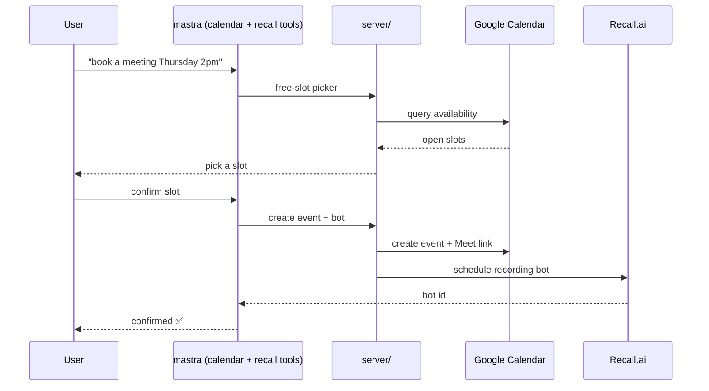

# 🎙️ Casper Agent

[](https://github.com/Michsantozz/karaforcasper/actions/workflows/ci.yml)


**The AI meeting assistant that reads the room — not just the transcript.**

Casper records your Zoom/Meet/Teams calls, turns them into actionable minutes, and — the part most note-takers skip — measures *how your team actually interacted*: who dominated, who went quiet, where the tension was, and how that shifts across meetings. All through chat.

- 🌐 **Live app:** https://casper.careglyph.com
- 💻 **Repo:** https://github.com/Michsantozz/karaforcasper

---

## ✨ What it does

**Meetings, end to end**
- **Schedule from chat** — "book a meeting Thursday 2pm" creates the Google Calendar event, the Meet link, and the recording bot in one shot (free-slot picker included).
- **Auto-record a whole calendar** — flip it on once and every future event with a meeting link gets a bot automatically (deduped, self-healing) — no per-meeting booking.
- **Send & control bots** on any Zoom/Meet/Teams call — send a bot, start/stop recording, remove it, all from chat.
- **Automatic minutes** — when the transcript lands, a webhook generates summary, decisions, action items, topics, and soundbites, then notifies you. No coming back to ask.
- **Meeting notebook** — synced player, karaoke transcript, decisions, moments, and one-click clips.
- **Ask across every meeting** — "what did we decide about pricing?" searches your whole history and cites the source.
- **Attach screenshots & PDFs to chat** — drop an image or PDF into the assistant and the vision model reasons over it (allowlisted, size-capped, rate-limited).
- **Share read-only, revocably** — publish a whole meeting (player, searchable karaoke transcript, decisions, talk-time) to anyone via an unguessable link, and revoke it anytime. No account needed on the other end.
- **Self-serve recovery** — the meetings list has server-side search, status filters, and infinite scroll; retry a failed enrichment or cancel a scheduled bot yourself, no support ticket.

**Team dynamics 🧠 — the differentiator**
- **Meeting-health dashboard** — talk-time per person, interruptions (who cut off whom), silences, monologues, and a participation **balance** score. Pure timestamp math: deterministic, no LLM, always on.
- **AI insight** — one Fireworks call turns the metrics into a manager-facing read ("one voice dominated; little pushback from the rest") and labels each moment with what happened + an emotional tone.
- **Acoustic tension detection** — on demand, Casper decodes the audio in your browser (WebCodecs, no upload) to tell *real* tension (loud, agitated overlap) from a casual "yeah, yeah". Tense moments get a 🔥.
- **Trends over time** (`/meetings/trends`) — who's fading out or taking over the room, rising friction, whether the team is getting more or less balanced — with signals the agent raises tactfully: *"Marina dropped from 22% to 4% over 6 meetings."*

Just ask: *"how did the team interact?"*, *"is anyone going quiet?"*, *"was there tension?"*

> **🔒 Honest scope.** Dynamics metrics and trends are deterministic math over transcript timestamps — reliable whenever word-level timing is present (Recall provides it). The AI *insight* (verified live against Fireworks `glm-5p2`) and *acoustic tension* pass are additive layers on top; neither is required for the core dashboard.

---

## 🚀 Why it stands out

- **Behavior, not just content.** Others summarize *what* was said. Casper reads *how the team worked* — the layer Gong sells to sales teams, brought to everyday internal meetings.
- **Not one prompt — a supervised agent network.** A Casper supervisor routes per-meeting questions to a **Minutes** specialist and cross-meeting history/trends questions to a **Search** specialist, each with its own scoped toolset.
- **Remembers you.** A durable per-user profile (timezone, default duration, recording prefs) persists across every conversation, plus **semantic recall** over past chats (Fireworks embeddings → pgvector) — not a rolling last-N window.
- **Real product, not a demo.** Live deployment, multi-tenant by construction (Postgres RLS + ownership checks), Svix-signed fail-closed webhooks, and bounded app-level retries backed by **two independent recovery crons** (reconcile stuck rows + backfill missing ones).
- **Runs on AMD.** Chat, embeddings, and the meeting-health insight all default to **Fireworks AI** (AMD hardware).

---

## 🏗️ Tech stack

| Layer | Technology |
|---|---|
| App | Next.js 16, React 19 (App Router + RSC) |
| Agent | Mastra (agents, tools, workflows) |
| LLM | **Fireworks AI** (default — chat, embeddings, insight; on AMD) · AWS Bedrock fallback |
| Team dynamics | Deterministic timestamp analysis + Fireworks insight + browser audio (WebCodecs) |
| Meetings | Recall.ai (REST + MCP), Google Calendar OAuth |
| Data | Postgres + Drizzle (multi-tenant RLS) |
| Workflows | Inngest (crons, reconcile loop) |
| Storage / Email | S3 / MinIO · Resend |

---

## ⚙️ How it works

**Schedule** → agent renders a free-slot picker, then creates the Calendar event + Meet link + bot in one call.

**After the meeting** → Recall fires a Svix-verified `transcript.done` webhook → enrichment runs (idempotent, with retry): minutes **+** team-dynamics metrics **+** one Fireworks insight call, all persisted → you get a notification. A reconcile cron rescues anything that failed.

**Anytime** → ask the agent across your whole meeting history or about how a team is trending; reads are scoped to you and never leak across tenants.

---

## 📦 Setup

Requires **Node ≥ 24** and **pnpm**.

```bash
pnpm install
cp .env.example .env.local   # fill the required groups (see the annotated file)
pnpm db:migrate
pnpm dev                     # app
pnpm dev:inngest             # autonomous workflows (separate terminal)
```

**Required env** (grouped in `.env.example`): `DATABASE_URL` · auth (`BETTER_AUTH_URL`, `NEXT_PUBLIC_APP_URL`) · LLM (`MODEL_PROVIDER=fireworks`, `FIREWORKS_API_KEY`, `FIREWORKS_MODEL_ID`) · Recall (`RECALL_API_KEY`, `RECALL_WEBHOOK_SECRET`) · Google OAuth · S3/MinIO · `NEXT_SERVER_ACTIONS_ENCRYPTION_KEY`. Email (`RESEND_API_KEY`) is optional — without it the in-app bell still works.

**Recall webhooks** (Recall dashboard, same Svix secret): calendar → `{APP_URL}/api/webhooks/recall` · bot → `{APP_URL}/api/webhooks/recall/bot` (subscribe to `transcript.done`).

**Full self-host stack** (Postgres + MinIO + Inngest + app):

```bash
cp .env.example .env   # fill [SECRET] values
docker compose up -d --build
```

---

## 🧪 Commands

```bash
pnpm dev / dev:inngest   # dev server / workflows
pnpm build / start       # production
pnpm typecheck           # tsc --noEmit
pnpm lint                # ESLint (+ architecture boundary rules)
pnpm test                # Vitest (unit hermetic; integration/e2e opt-in)
pnpm db:migrate          # Drizzle migrations
```

Unit tests are hermetic (external services mocked). Live/E2E flows are opt-in (`RUN_LIVE_E2E=1`) and consume real API credits.

---

## 🛡️ Security

- **Passwordless magic-link sign-in** (email) — no password to leak; every route is auth-gated and user ids come from the session, never the request body.
- Meetings, threads, and uploads are per-user via Postgres **RLS** (`withUserScope`) + ownership checks (`assertBotOwner`) — cross-tenant reads 404, never leak. A boot guard warns if the DB role can bypass RLS.
- Webhooks are Svix-signed (HMAC-SHA256, timing-safe, anti-replay) and **fail-closed**.
- Uploads are MIME-allowlisted, size-capped, and rate-limited (DB-backed, shared across replicas); in chat, a forged `meetingBotId` is silently dropped unless you own the bot.
- A **per-user 24h cost ceiling** caps spend before generation and a token limiter caps each response — runaway cost can't happen.
- Optional LLM guardrails (`ENABLE_LLM_GUARDRAILS=true`) block prompt injection and redact PII on the chat agent.

---

## 🧩 Architecture

Feature-based, colocated with the App Router, with layer boundaries **enforced by ESLint** (`eslint-plugin-boundaries`): `app/` routes only, business logic in `features/<domain>/`, server-only code in `server/`, generic UI/DB/utils in `shared/`. Full rules in `CLAUDE.md`.

Solid arrows are requests; dashed arrows are the responses flowing back.

### 🔄 Enrichment — after a meeting



### 💬 Chat — ask across meetings



### 📅 Schedule — book from chat



**Layer rules behind these flows:** unidirectional `app → features/mastra → server/shared` (never the reverse). `shared/` is a leaf. `server/` is server-only — feature UI never imports it; only `app/api/*`, Server Actions, and `mastra/` reach it, and it alone talks to Recall.ai, Postgres, and S3. `mastra/` also fires Inngest crons (backfill · reconcile) that loop back to rescue lost webhooks.
